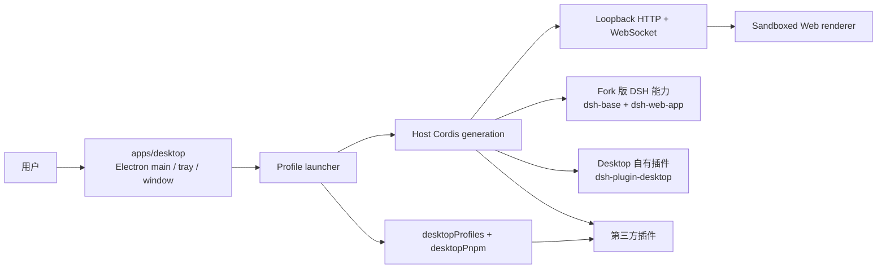

# OpenHarness 架构

OpenHarness 是一个 pnpm monorepo 桌面/多端产品,把 **Fork 打补丁后的 DeepSeek Harness(DSH)内核** 与 **Electron 桌面壳** 通过 **Cordis 插件机制** 组合成同一个运行时。

技术栈:pnpm workspace + monorepo + turbo + changesets + TypeScript + Biome + React。

参考项目:[anywhere-labs/deepseek-harness-desktop](https://github.com/anywhere-labs/deepseek-harness-desktop.git)(架构文档见其 `docs/architecture.md`)。本项目沿用其核心架构决策,并把"固定上游子模块、不改上游"替换为"**fork 进 monorepo、直接打补丁**"。

## 总览

DSH Desktop 是一个薄的 Electron 宿主。Electron main 监督一个 **ELECTRON_RUN_AS_NODE 子进程**,子进程在 fork workspace 内启动 Fork 版 DSH Host 的 Cordis generation(选项 d,2026-08-18 spike 定案),Host 通过 loopback HTTP/WebSocket carrier 提供 Web UI。Desktop 不另造 renderer IPC 插件系统,也不把 Electron API 暴露给页面——**桌面壳本身就是一个合法的 DSH 插件**。

在 OpenHarness 中,桌面代码分两层:**`apps/desktop` 才是真正的桌面端代码**(Electron 宿主、窗口、托盘、生命周期、打包);**`packages/dsh-plugin-desktop` 采用 Cordis 机制**,是组合进 Host generation 的插件包,不含 Electron 应用代码。



## 仓库结构与所有权边界

```text
openharness/                  pnpm workspace + turbo + biome + changesets
├── packages/
│   ├── deepseek-harness/     Fork 的 DSH 内核(@deepseek-ai/dsh-root 及其嵌套 pnpm workspace)
│   │                         上游代码 + 补丁直接落在这里;保留完整 Cordis 机制
│   └── dsh-plugin-desktop/   Cordis 插件包:采用 Cordis 机制组合进 Host generation
│                             (Host face services + Client face + bundle patch),不含 Electron 应用代码
├── apps/
│   ├── desktop/              真正的桌面端代码:Electron main/launcher/窗口/托盘/生命周期 + 打包
│   ├── web/                  浏览器版 UI(复用内核 Web 前端,面向远程/HTTP 后端)
│   ├── cli/                  CLI 封装(消费 fork 的 dsh 入口)
│   └── mobile/               移动端占位(远期:远程连接 Desktop)
├── docs/                     本目录:架构与改造计划
└── turbo.json / biome.json / .changeset/
```

所有权规则:

- `packages/deepseek-harness` 内部保持上游的包名(`@deepseek-ai/dsh-*`)、目录结构、工具链与其自身的 pnpm workspace。补丁直接提交进 fork,但**每一处偏离上游的修改都必须登记**(补丁台账,见 [refactor-plan.md](refactor-plan.md) Phase 1),以便上游同步时可逐条重放或废弃。
- `packages/dsh-plugin-desktop` 与 `apps/*` 是本项目自有代码,包名与版本由本仓库 changesets 管理。两者分工:**`apps/desktop` 才是真正的桌面端代码**(Electron main、窗口、托盘、生命周期、打包);**`packages/dsh-plugin-desktop` 只采用 Cordis 机制**(service 定义、Host rows、Client face、bundle patch 层),与其他 DSH 插件同路径组合进同一运行时,插件包内不含 Electron 应用生命周期代码。注意:npm 名 `dsh-plugin-desktop` 已被参考项目发布,本包保持 `private: true`、永不以该名发布;如未来发布需改用 @openharness scope。
- 根 pnpm workspace **不吸收** fork 的内部包;fork 在自己的目录内用自带的 pnpm 安装与构建(与参考项目"隔离 workspace"决策同构,只是由 Yarn 外层/pnpm 子模块换成 pnpm monorepo/嵌套独立 workspace)。`pnpm-workspace.yaml` 必须显式枚举自有包(`packages/dsh-plugin-desktop` + `apps/*`),**不得使用 `packages/*` glob**——否则 fork 根包会成为根 workspace 成员,其 devDependencies 会被根安装、其 `postinstall` 的 lefthook 钩子会装进外层仓库。

### 运行时版本约束与 fork 产物消费机制(spike 已定案)

- **Electron 版本约束**:fork 的 engines 是 `node ^22.19.0 || >=24.0.0`,因此 `apps/desktop` 的 Electron 必须选内置 Node 满足该条件的大版本。当前决策:**Electron ^43**(内置 Node 24.x;Electron 36.9.5=Node 22.19.0 为最低线)。
- **消费机制:选项 (d) Host 进程外运行**(2026-08-18 spike 验证通过,证据见 `spike/`)。Electron main 以
  `ELECTRON_RUN_AS_NODE=1 <electron> --expose-internals --import tsx/esm apps/cli/src/bin.ts --profile web --port 0`
  形态(开发态源码启动;生产态换 fork 构建产物)在 fork workspace 内启动 Host 子进程;fork 内部 `workspace:*` 互链全部在其自身 workspace 内解析,外层无需任何对 fork 的包依赖。
- **两条硬性 launcher 规则**(spike 实测):
  1. 子进程 argv 必须携带 `--expose-internals`——fork 的裸插件解析依赖 Node 内部 loader(`ModuleLoader.fromInternal()`),其 `node-addon-require-builtin` 路径在 Electron 运行时不可用;`--expose-internals` 是无需 fork 补丁的替代路径;
  2. webserver 必须用 `--port 0` 临时端口(默认 3080 可能被占用),绑定钉死 `127.0.0.1`。
- 与参考项目的差异:参考项目 Host 与 Electron 同进程;OpenHarness 的 Host 在子进程。子进程生命周期(启动监督、崩溃恢复、协同关闭、进程树清理)是 `apps/desktop` 的一等职责。

## 运行时架构

### 薄 Electron 宿主 + loopback carrier

- **Electron main**(归 `apps/desktop`)是最小引导代码:获取单实例锁、解析选中的 DSH profile、提供 native runtime 能力,然后以 `ELECTRON_RUN_AS_NODE` 子进程在 fork workspace 内启动 Host Cordis root(消费机制选项 d);组合进 generation 的桌面层是 Cordis 插件包 `packages/dsh-plugin-desktop`。
- **Host generation** 由 fork 的 `@deepseek-ai/dsh-app-boot` 的 `boot()` 组装:按 profile 的 `dsh.profile.bundles` 顺序叠加补丁层 —— `dsh-base`(模型适配器、工具、持久化、沙箱与审批策略、settings、credentials、遥测)→ `dsh-web-app`(webserver、API 网关、浏览器插件名册、client HMR 链)→ launcher 在 `dsh-web-app` 之后临时插入的 desktop 层(不落盘)。
- **Carrier**:Host 把 HTTP/WebSocket 面绑定到 `127.0.0.1` 的临时端口(`ctx.webServer`),Electron 创建沙箱 BrowserWindow 并加载该同源页面。renderer 里没有 Electron 自有插件名册、没有 preload 桥、没有裸 Electron API。
- **第三方插件**走与浏览器 Web 完全相同的 DSH 模块图:Host 路由、RPC、client metadata、services、slots。

### 启动顺序

1. Electron 获取单实例锁,读取 Desktop 私有的 profile/mode 状态(Electron user data,不是选中 profile 里的字段)。
2. Launcher 准备激活 profile;`list()` 只读发现,不为列举而改写用户 profile。
3. Launcher(`apps/desktop`)在 Loader entries 挂载前,经 `boot()` 的 `prepare` 钩子注册 generation 级 bootstrap 事实与服务:`ctx.desktopProfiles`(公开,由 dsh-plugin-desktop 以 Cordis 机制实现)、`desktopPnpmBootstrap`(私有)、`ctx.desktopRuntime`(内部适配器,指向 apps/desktop 的原生能力)。
4. Host Cordis root 启动 Loader entries,第三方插件可读取前 desktop service 已就位。
5. `dsh-base` + `dsh-web-app` + profile 中的第三方 bundle 组成 Web carrier。
6. Host 绑定 loopback 端口;`app-boot` settle 并审计完整 profile 后,Electron 才创建 BrowserWindow,首个 renderer manifest 即包含官方、desktop 与第三方 client 插件。
7. Web surface 成功加载后才创建托盘,并提交 profile 的 last-known-good 状态。

### Generation 生命周期

任何 profile 或模式切换都 **dispose 当前 generation,再启动新的 generation**。Service reference、窗口对象、subprocess handle 一律不得跨 generation 缓存;保留的引用在 disposal 后调用必须失败。重启是唯一的组合边界:应用绝不在存活的 renderer generation 内热替换 root slots、native 材质或 Loader rows。

## 职责分工:apps/desktop 与 dsh-plugin-desktop

本项目把桌面产品拆成两层。这是与参考项目的**结构性差异**:参考项目把整个桌面壳(Electron 宿主 + 插件)集中在单一包 `dsh-plugin-desktop` 中;OpenHarness 把"真正的桌面端代码"与"Cordis 机制"分离。

- **`apps/desktop` = 真正的桌面端代码**:Electron main 进程、单实例锁、launcher、`BrowserWindow` 与导航策略、物理托盘、close-vs-quit 生命周期、重启协调器、electron-builder 打包。对应参考架构中的 "Launcher + native runtime" 角色。
- **`packages/dsh-plugin-desktop` = 采用 Cordis 机制的插件包**:全部实现为 Cordis rows/services/effects,与 `dsh-base`、`dsh-web-app`、第三方插件同路径组合进 Host generation;不含 Electron 应用生命周期代码,需要原生能力时经 launcher 提供的内部适配器。

### dsh-plugin-desktop 的 Host 面(Cordis 机制)

| 插件/row | 职责 |
|---|---|
| `desktop-profiles` | 提供 `ctx.desktopProfiles`;`current` 不可变,`list()` 只读发现,`select()` 持久化 pending target 并请求有序重启 |
| `desktop-pnpm` | 用上游 subprocess service + launcher 私有 bootstrap 事实构建 `ctx.desktopPnpm`,管理打包 pnpm 操作 |
| `desktop-shell` | 注册 `dsh-desktop` settings namespace;以 Cordis effects 贡献重启请求、托盘命令条目等 |
| native runtime 适配 | `ctx.desktopRuntime` 由 launcher 提供、指向 apps/desktop 的窗口/托盘能力,仅 desktop 自有 row 使用 |

物理窗口与托盘由 `apps/desktop` 持有;插件侧只在 profile 激活期注册窗口值、经有序条目注册表贡献命令条目、请求生命周期动作——不跨 generation 持有 Electron 对象。

### 内部接缝:`ctx.desktopRuntime`(apps/desktop 实现,dsh-plugin-desktop 消费)

两层拆分使生命周期动作的**执行方**在 `apps/desktop`,因此需要一个显式的内部适配器契约(私有,第三方不得依赖):

```ts
// 由 launcher(apps/desktop)在 Loader entries 挂载前 provide
interface DesktopRuntime {
  /** 生命周期:插件只请求,apps/desktop 的重启协调器决定并执行 */
  requestRestart(reason: 'profile-switch' | 'mode-change' | 'settings-committed'): void
  /** 托盘:插件贡献条目,apps/desktop 持有物理托盘与有序条目注册表 */
  readonly trayItems: TrayItemRegistry
  /** 窗口值注册:插件在 profile 激活期注册,apps/desktop 构造 BrowserWindow 时消费 */
  registerWindowValues(values: DesktopWindowValues): () => void
}
```

规则:`app.relaunch()` 只能由 `apps/desktop` 的重启协调器调用,且仅在 Cordis 树零码退出之后;插件侧永远不直接调用 Electron API,不持有窗口/托盘对象引用。

**选项 d 的推论(Phase 3 定案)**:Host 运行在子进程中,launcher 无法像参考项目那样直接向 Host ctx provide 该适配器。实现路径是 **Host↔launcher 控制通道**:desktop 层追加一个 bridge row(在子进程内 provide `ctx.desktopRuntime`),经 loopback 控制面把 `requestRestart`/托盘条目/窗口值转发给 Electron main。通道与 bridge row 随 Phase 4 打包运行时落地;在此之前各 row 容忍适配器缺席(`ctx.get('desktopRuntime')?.`),重启动作经 tray/Electron 侧完成。

**公开契约只有两个 service**(第三方插件可依赖,但在普通 DSH 下必须视为可选):

```ts
// 类型导入自 dsh-plugin-desktop/profile-service
interface DesktopProfiles {
  readonly current: { readonly name: string; readonly dir: string }  // generation 内不可变
  list(): readonly DesktopProfileSummary[]                            // 只读发现
  select(name: string): Promise<void>                                 // 持久化 pending target → 有序重启
}

// 类型导入自 dsh-plugin-desktop/pnpm
interface DesktopPnpm {
  run(args, signal?): DesktopPnpmHandle          // 低层:直接跑打包 pnpm,不含 DSH 语义
  runPlugin(args, invokingDir, signal?): DesktopPnpmHandle  // 插件增删改必须用它(dsh plugin 语义)
}
```

**私有、非第三方 API**:launcher 的 `desktopRuntime`、`desktopPnpmBootstrap`、Electron 可执行文件、Node helper 与 ABI 环境。这些归 `apps/desktop` 所有,`dsh-plugin-desktop` 只是其受控消费者。

### Client 面

Client face 先校验 Host 提供的 mode 与平台标记:

- **compatibility 模式**:校验后直接返回,不注册 layout/root/sidebar/conversation override,保留选中 profile 自身的官方组合。desktop 自有的 boot-health 上报与本地目录拖放仍以能力 effect 形式存在。
- **advanced 模式**:安装 desktop 自有 layout service 与 root occupant(root 声明 sidebar/conversation/details/overlay 席位),官方 `ui-sidebar`、`ui-conversation` row 保持启用、`ui-layout` row 被禁用;附带窄域 theme presenter 把上游主题投影到 document,并把 `ui-theme.preference` 镜像到 Electron 原生外观。

## 模式设置与重启边界

DSH home 的 `settings.yaml` 是唯一事实来源:

```yaml
dsh-desktop:
  mode: compatibility   # 或 advanced
```

- Launcher 在组合 generation 前,通过激活的 `dsh-settings-file` row 解析同一文件;Host 用标准 settings service 注册 `dsh-desktop` namespace。profile manifest 里没有平行的 mode 值。
- tray 切换(在 `apps/desktop`)或手改 `settings.yaml` 都收敛到同一个持久值(经插件注册的 `dsh-desktop` namespace 写入);已提交的变更请求一次有序重启:先 dispose Cordis 树,零码退出成功后才 `app.relaunch()`。失败的 generation 不重启;重复重启请求幂等。
- advanced 模式仅支持 macOS/Windows;Linux 拒绝 advanced 值而非静默回退。

## 与参考项目的关键差异(Fork 打补丁机制)

| 维度 | 参考项目(deepseek-harness-desktop) | OpenHarness |
|---|---|---|
| 内核引入方式 | Git submodule 固定官方 commit,只读;运行时包解析自 npm registry | Fork 进 `packages/deepseek-harness`,补丁直接落盘 |
| 外层包管理 | Yarn 4 workspace(node_modules linker) | pnpm workspace + turbo |
| 内核 workspace | 上游自带 pnpm workspace,与外层 Yarn 隔离 | 同样保持嵌套独立 pnpm workspace,根 workspace 不吸收 |
| 版本管理 | `upstream.json` 记录 source pin 与 runtime family | changesets 管理自有包;fork 用补丁台账 + git 历史追踪偏离 |
| 补丁自由度 | 不允许改上游(需要行为差异时只能外层组合/patch 层) | 允许改 fork,但每处偏离必须登记并可随上游同步重放 |
| 桌面代码组织 | 桌面壳(Electron + 插件)集中在单一包 `dsh-plugin-desktop` | 两层分离:`apps/desktop` 是真正的桌面端代码;`packages/dsh-plugin-desktop` 只采用 Cordis 机制 |
| Host 进程形态 | Host 与 Electron 同进程(main 进程内 boot) | Host 在 `ELECTRON_RUN_AS_NODE` 子进程内 boot(选项 d,spike 定案);loopback carrier 跨进程,Electron main 负责子进程监督与生命周期 |

推论:当外层组合无法表达某个需求时(例如 Host 引导缝隙、webserver 对 Electron 的假设),本项目**可以**修改 fork,但必须:

1. 在补丁台账(`packages/deepseek-harness/PATCHES.md`)登记动机、范围与上游同步策略;
2. 遵守 fork 自身的 `AGENTS.md` 约定(Agent Note、测试、JSDoc、ESM 等),使补丁在上游风格内可审查;
3. 优先用 Cordis 扩展点(bundle/patch 层、service provider 替换)而非改 loop;改 `agent-loop` 必须更新 fork 的 `docs/architecture.md`。

## 安全边界

- renderer 保持 `contextIsolation`、Chromium sandbox、禁用 Node integration;导航锁定精确 loopback origin,外链委托操作系统。
- Host webserver 绑定**钉死 `127.0.0.1`**,launcher 与任何 patch 都不得改为 `0.0.0.0`(fork CLI 已拒绝该值;desktop 继承同一姿态)。上游 webserver 无 TLS/auth,任何本机进程可达该端口,安全边界由 DSH 自身的沙箱与审批策略承担。
- 不为 Host service 增加 preload/Electron IPC 传输;带浏览器 UI 的第三方插件继续走普通 DSH Host 路由。
- 打包运行时(归 `apps/desktop`):Electron Builder + `app.asar`,需要物理 unpack 的依赖放 `app.asar.unpacked`;packaged runtime gate(`scripts/runtime-gate.mjs`)校验物理运行时入口,profile fallback 不得把符号链接指向无法被虚拟 ASAR 解析的路径。**运行时闭包**由 `scripts/stage-runtime.mjs` staging 到 `runtime/desktop/`(隔离 workspace):零补丁期安装 npm 已发布的 0.1.0-rc.7 家族 + 本地 `dsh-plugin-desktop`,经 `extraResources` 进包、锚定 `process.resourcesPath/runtime`;首个偏离上游的 fork 补丁起,改用 fork `release:pack` tarball(登记 PATCHES.md)。打包态子进程以构建的 `@deepseek-ai/dsh/lib/bin.js` 启动(无 tsx);web 闭包当前无 native 模块(landlock-run 仅 Linux),新增 native 依赖须经 ABI rebuild 评审。
- 打包 macOS/Linux 启动时从账户 shell 恢复 `PATH`(允许名单内补 locale/toolchain 变量),凭据、`DSH_*`、proxy、SSH-agent 等敏感值按上游 `SENSITIVE_ENV_PATTERN` 过滤,不进 Electron。

## 深入阅读

- fork 内核架构:`packages/deepseek-harness/docs/architecture.md`(Cordis、profiles/bundles、turn flow、capability seams)
- Cordis 入门:`packages/deepseek-harness/docs/cordis-primer.md`
- 参考项目架构:<https://github.com/anywhere-labs/deepseek-harness-desktop/blob/master/docs/architecture.md>
- 参考项目 service 契约:`dsh-plugin-desktop/docs/plugin-services.md`(同上仓库)
- 本项目改造计划:[refactor-plan.md](refactor-plan.md)
