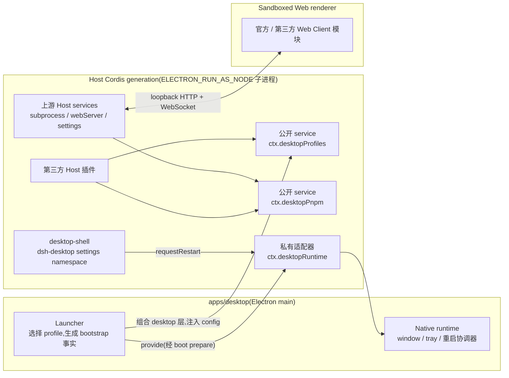

# dsh-plugin-desktop service 契约

Host 侧集成契约(插件作者视角)。覆盖 `desktopProfiles` 与 `desktopPnpm` 两个公开 Cordis
service;**不**授予第三方对裸 Electron API、renderer 或 launcher bootstrap 状态的访问。

## 层与数据流



launcher 在 Loader entries 挂载前组合 desktop 层并联接 bootstrap 事实;
`desktopProfiles.current` 在该 generation 内不可变。profile/mode 切换 dispose 整个
generation 并启动新的——service 引用不得跨越该边界。renderer 不能直接读取这些 Host
service;桌面不为它们增加 preload 或 Electron IPC 桥。

## `desktopProfiles`

```ts
import type { DesktopCurrentProfile, DesktopProfiles } from 'dsh-plugin-desktop/profile-service'

interface DesktopProfiles {
  readonly current: { readonly name: string; readonly dir: string }
  list(): readonly DesktopProfileSummary[]
  select(name: string): Promise<void>
}
```

- `current` 在一个 generation 内不可变。不要从 argv、`ctx.baseUrl`、settings、Loader rows
  或 `$DSH_HOME` 推断 name/dir。
- `list()` 只读发现,不改写 manifest、patch 或 bundle 顺序;可返回 visible-but-disabled 条目。
- `select(name)` 是重启操作,不是原地变更:先持久化已接受的 target,再请求有序重启。
- disposal 之后经保留引用调用必须失败;从下一个 generation 重新读取 `current`。

## `desktopPnpm`

```ts
import type { DesktopPnpm, DesktopPnpmHandle } from 'dsh-plugin-desktop/pnpm'

interface DesktopPnpm {
  run(args: readonly string[], signal?: AbortSignal): DesktopPnpmHandle
  runPlugin(args: readonly string[], invokingDir: string, signal?: AbortSignal): DesktopPnpmHandle
}
```

| 方法 | 进程与工作目录 | 用途 |
|---|---|---|
| `run(args)` | 打包 pnpm 直接执行,cwd = 激活 profile 目录 | 低层包管理操作,**不含** DSH 语义 |
| `runPlugin(args, invokingDir)` | `dsh plugin --profile <active>`,cwd = 调用方绝对目录 | 插件 add/remove/update/修复,**必须用它** |

`run()` 不是 `runPlugin()` 的简写:直接 pnpm 不承诺首次 profile 初始化、调用方相对
`file:`/`link:` 锚定、成功后的 `dsh.profile.bundles` 协调。两个方法都校验非空、无 NUL 的
argv;一个 generation 同时只允许一个操作;`done` 在完整进程树退出后才 settle;支持输入
`AbortSignal` 与显式 `cancel()`。

## 第三方兼容规则

- 两个公开 service 在普通 DSH(Web/headless profile、无桌面 launcher)下**不存在**;
  跨环境插件必须动态探测(`ctx.get(...)`),缺席时保持普通 DSH 行为。
- 桌面 service 永远不得成为跨环境插件的必需 Cordis 注入。
- `ctx.desktopRuntime`、bootstrap 事实、Electron 可执行文件与 ABI 环境是私有面,
  不属于第三方契约。

## 当前实现状态(scaffold)

- `desktopProfiles.list()` 只报告激活 profile;完整发现在 apps/desktop Phase 3。
- `desktopProfiles.select()` 直通重启接缝;persist-before-restart 序列化在 Phase 3。
- `desktopPnpm` 开发态用 `node:child_process`(shell-free argv);打包态可执行文件选择与
  子进程私有环境在 Phase 4。
- advanced Client face(layout service / root occupant / theme presenter)在 Phase 5。
